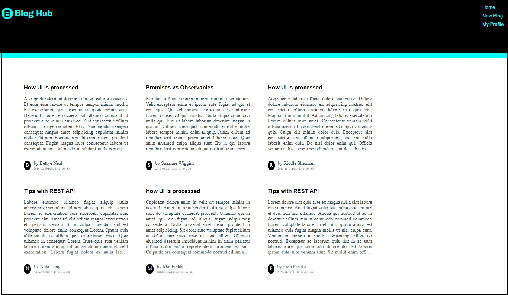

## Practice

This practice comprises 3 exercises.

### Context

Blogs are the medium of sharing ideas, knowledge or opinions on various fields.

The word `Blog` is derived from the term `weblog` which refers to the activity of
logging content over web.

The app `Blog Hub` is an SPA designed using Angular that should allow user to 
write and read blogs.

The design phase of the app is completed and the UI layouts are ready to capture 
and present blog data.

You as an Angular front-end developer are required to make application interact 
with the server to fetch and store blogs.

#### Getting Started
- The boilerplate code has the file `blogs.json` file located under `blog-hub-data` and it contains the data of blogs in `json` format.
- Run the `json-server` to launch `blogs` api to allow the frontend application to interact with the blogs data.
- The boilerplate also contains `blog-hub` app code with required components created and styles applied.
- The `blog-hub` app contains models folder with `blog.ts` file that defines the `Blog` type.
- Follow the tasks listed down for each practice and develop solution to implement persistence for blogs data using Angular Services.   

### Problem Statements

#### Practice 1 - Fetch Blog Posts

Make HTTP request to `blogs` api to fetch blog posts data from server.

The fetched data should be presentated to the user neatly on the home view.

##### Tasks
- The responsibility of making server calls should be handled by the Angular service.
- Create service for blog under `services` folder using Angular CLI command:

    `ng generate service services/blog` or `ng g s services/blog`
- The `blog` service should use `HttpClient` to make HTTP requests to `json-server` running `blogs` api.
    - `HttpClient` object should be injected into the `blog` service.
    - `HttpClient` object methods `get()`, `post()`, `put()` or `delete()` return Observable upon execution
    - `Observable` allows making requests to server asynchronously
- Define method `getAllBlogs()` in `blog` service that makes request to `blogs` api using HttpClient object.
    - The method returns `Observable` with Blog Array type data.
- To consume the `blog` service, 
    - the `view-blogs` component designed for generating home view should be injected with the `blog` service dependency using constructor injection mechanism.
    - the component should invoke the service function that makes request to the server to fetch blogs and returns Observable producing values of type Blog Array.
    - the `view-blogs` component should subscribe to the observable returned and fetch the data and store it in an array of type `Blog`.
        - the blog data can then be displayed by the component using `*ngFor` directive and interpolation technique.
- Below is the snapshot of expected output:

    

#### Practice 2 - Add New Blog

Make HTTP request to `blogs` API to save blog data to server.

Raise alert with text `Blog added successfully` once the blog is posted.

##### Tasks

- This practice exercise is in continuation to the previous practice exercise.
- In the `blog` service, define method that accepts blog object and posts it to the server.
    - The method should call `post()` method of HttpClient and return the observable returned by the post() method.
- To consume this service functionality, 
    - the `add-blog` component designed to handle add blog responsibility, should inject the `blog` service dependency using constructor injection mechanism and invoke the service function that makes request to server to post blog data.
    - the `add-blog` component should subscribe to the observable returned and for the response received, it should raise alert with the message `Blog added`.
        - If the user navigates to `Home` view, the blogs on the view should now be updated with the newly added blog.
- Below is the snapshot of expected output:

    
#### Practice 3 - Handle HTTP Error Response

The HTTP requests may respond with an error. 

Modify the `blog-hub` code to handle HTTP Error responses.

##### Tasks

- This practice exercise is in continuation to the previous practice exercise.
- The `view-blogs` component rendering blogs and the `add-blog` component posting blogs should handle the error responses while making service calls.
- The handling code should raise alert with error messages to notify the user about the error.
- To handle error, the parameter of the `subscribe()` method called on observable returned by the service method should be modified.
    - The object in the service method should also include error property that is associated with afunction that contains error handling code.
- To test this functionality, change the port value in server URL with an invalid value and then check the output on the browser.
- Below is the snapshot of expected output:

    